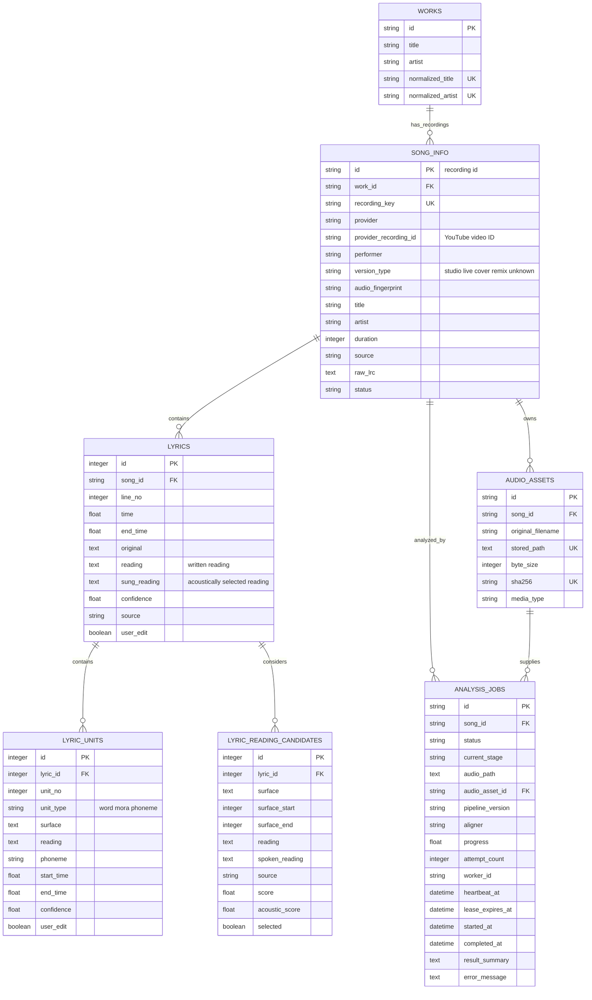

# LyriKana Backend DB ERD

The backend separates a musical work from each concrete recording. A studio track, live performance,
and creator cover may share a work but always have different recording IDs and timing data.

`recording_key` is provider identity when possible, for example `youtube_music:<videoId>`. Metadata-only
requests fall back to a normalized title/artist hash for backward compatibility. The old unique constraint
on `normalized_title + normalized_artist` is removed during SQLite migration so multiple recordings can
coexist.

`lyrics` stores presentation lines. `lyric_units` stores the word/mora/phoneme timeline used for karaoke
highlighting and re-segmentation. Display text, dictionary reading, and the acoustically selected sung
reading are deliberately independent.

`audio_assets` contains only audio explicitly supplied by the user and de-duplicates each recording by
SHA-256. `analysis_jobs` is a persistent queue. A worker claims each row with a lease, renews its heartbeat
during long model calls, and safely re-queues an expired lease up to the configured attempt limit.
