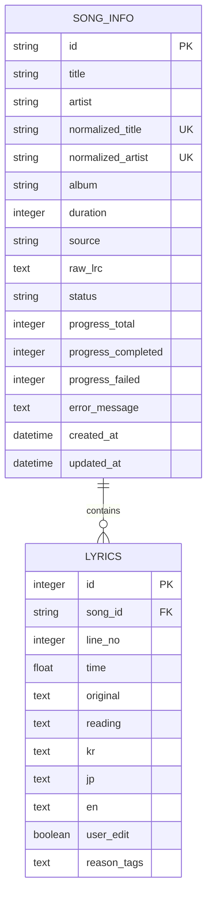

# LyriKana Backend DB ERD

The current development schema deliberately keeps the lyrics cache small and persistent.

`normalized_title + normalized_artist` uniquely identifies a song. Duration is supporting candidate-selection metadata, not song identity. `lyrics.song_id + line_no` is unique, and deleting a song cascades to its lines.

`en` is nullable until an English conversion exists. `reason_tags` is JSON encoded for SQLite portability. Processing state lives on `song_info` so status requests do not scan every lyric line.

The previous singular `lyric` table stored all lines as JSON. Startup migration copies those values into `lyrics` when necessary and leaves the original table intact.

Electron maintains a separate local cache only for reusable reading-analysis candidates and user corrections. It does not fetch or store song-level LRCLIB payloads in the active architecture.
