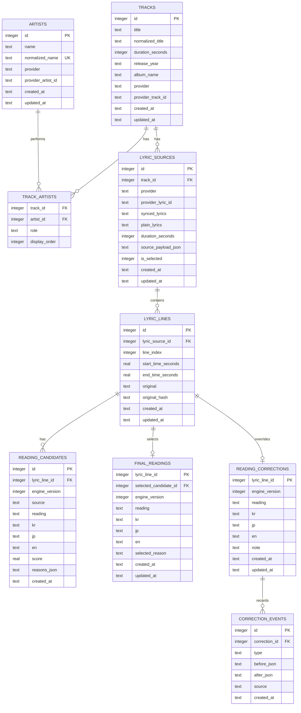

# LyriKana DB ERD

## Goal

LyriKana stores lyrics by artist and track, then caches line-level pronunciation
results so repeat playback can render immediately.

## ERD



## Table Notes

`ARTISTS`
: Stores artists once. Use `normalized_name` for matching names from YouTube
Music and LRCLIB.

`TRACKS`
: Stores song metadata independent of lyric provider. The best identity key is
`normalized_title + primary_artist + duration_seconds`.

`TRACK_ARTISTS`
: Supports multiple artists, features, and collaborations while still letting
lyrics be browsed by artist.

`LYRIC_SOURCES`
: Stores raw LRCLIB or future provider data. Multiple sources can exist for one
track, and `is_selected` marks the chosen synced lyric.

`LYRIC_LINES`
: Stores each synced lyric line with timestamp and original text.

`READING_CANDIDATES`
: Stores competing readings from `kuromoji`, `sudachi`, `yahoo`, future models,
or rule-based passes.

`FINAL_READINGS`
: Stores the selected result for fast playback.

`READING_CORRECTIONS`
: Stores manual/user-approved corrections. These override `FINAL_READINGS`.

`CORRECTION_EVENTS`
: Keeps correction history for later JSONL training data generation.

## Recommended Indexes

```sql
CREATE UNIQUE INDEX idx_artists_normalized_name
  ON artists(normalized_name);

CREATE INDEX idx_tracks_lookup
  ON tracks(normalized_title, duration_seconds);

CREATE INDEX idx_track_artists_artist
  ON track_artists(artist_id, track_id);

CREATE INDEX idx_lyric_sources_track_selected
  ON lyric_sources(track_id, is_selected);

CREATE UNIQUE INDEX idx_lyric_lines_source_index
  ON lyric_lines(lyric_source_id, line_index);

CREATE INDEX idx_lyric_lines_original_hash
  ON lyric_lines(original_hash);

CREATE INDEX idx_reading_candidates_line_version
  ON reading_candidates(lyric_line_id, engine_version, score DESC);
```

## Current Migration Direction

The current SQLite cache can map into this ERD like this:

- `lyric_sources` cache table becomes `ARTISTS`, `TRACKS`,
  `TRACK_ARTISTS`, and `LYRIC_SOURCES`.
- Current line-level `line_readings` becomes `LYRIC_LINES` plus
  `FINAL_READINGS`.
- Current `reading_candidates` maps directly to `READING_CANDIDATES`.
- Current `reading_corrections` maps directly to `READING_CORRECTIONS`.
